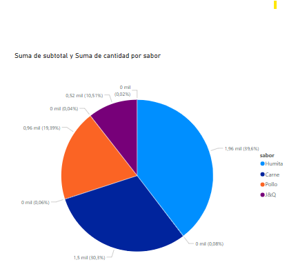

# 🥟 Empanadas_Javi_S

Proyecto académico de base de datos relacional utilizando **MySQL Workbench**, enfocado en la gestión de un negocio de empanadas. Incluye la creación de esquemas, inserción de registros, vistas, funciones, procedimientos almacenados, triggers y visualización de datos en Power BI.

---

## 📂 Contenido del repositorio

- `crear_bd_empanadas_Javi_S.sql`: script principal para la creación de la base de datos con sus 8 tablas.
- `insertar_datos.sql`: script con al menos 15 registros para alimentar las tablas.
- `consultas_informes.sql`: incluye las **4 vistas**, **2 funciones**, **2 procedimientos almacenados** y **1 trigger**.
- `EER Diagram.png`: diagrama entidad-relación generado desde MySQL Workbench.
- `PowerBI_Informe.pbix`: visualización del proyecto con gráficas dinámicas.
- `documentacion_empanadas_javi_s.pdf`: documentación explicativa del proyecto.

---

## 🧩 Funcionalidades

- Gestión de clientes, empleados, pedidos, sabores, ingredientes y stock.
- Subtotales automáticos por pedido y sabor.
- Control visual del stock bajo.
- Registro de eventos mediante trigger.
- Cálculo del total estimado por pedido.
- Visualización en **Power BI Desktop** conectada en tiempo real a MySQL.

---

## 🖥️ Tecnologías utilizadas

- **MySQL Workbench 8.0**
- **Power BI Desktop**
- **Git + GitHub**
- **Windows 11**

---

## 📊 Captura de visualización (Power BI)

> 

---

## 🚀 Cómo ejecutar el proyecto

1. Clonar el repositorio:
   ```bash
   git clone https://github.com/JaviSalazar31/Empanadas_Javi_S.git
   ```

2. Abrir los archivos `.sql` en **MySQL Workbench** y ejecutarlos en el orden:
   - `crear_bd_empanadas_Javi_S.sql`
   - `insertar_datos.sql`
   - `consultas_informes.sql`

3. Abrir `PowerBI_Informe.pbix` en Power BI Desktop y actualizar las visualizaciones si es necesario.

---

## 👤 Autor

**Javier Salazar**  
📍 Buenos Aires, Argentina  
📫 [LinkedIn](https://linkedin.com/in/javier-salazar-28b74b114)

---

## 📄 Licencia

Este proyecto es de uso académico. No tiene fines comerciales.
